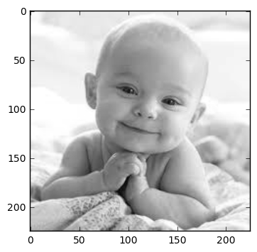
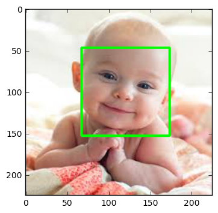
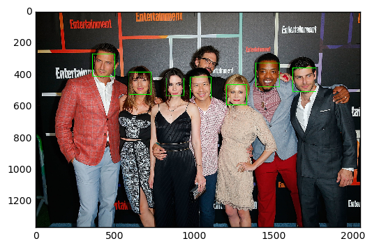
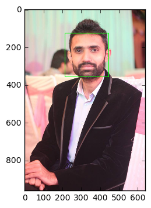
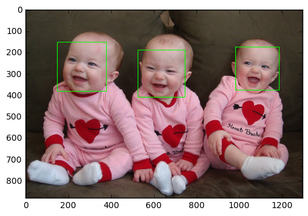
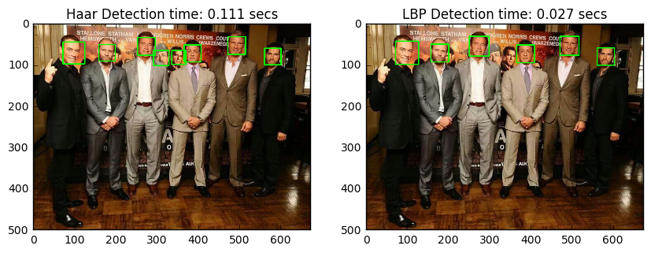

# Face Detection In Python Using OpenCV
<<<<<<< HEAD

=======

>>>>>>> origin/master
## OpenCV

OpenCV is an open source computer vision and machine learning software library. It is a BSD-licence product thus free for both business and academic purposes.The Library provides more than 2500 algorithms that include machine learning tools for classification and clustering, image processing and vision algorithm, basic algorithms and drawing functions, GUI and I/O functions for images and videos. Some applications of these algorithms include face detection, object recognition, extracting 3D models, image processing, camera calibration, motion analysis etc.

OpenCV is written natively in C/C++. It has C++, C, Python and Java interfaces and supports Windows, Linux, Mac OS, iOS, and Android. OpenCV was designed for computational efficiency and targeted for real-time applications. Written in optimized C/C++, the library can take advantage of multi-core processing.

## Face Detection

Face detection has gained a lot of attention due to its real-time applications. A lot of research has been done and still going on for improved and fast implementation of the face detection algorithm. Why is face detection difficult for a machine? Face detection is not as easy as it seems due to lots of variations of image appearance, such as pose variation (front, non-front), occlusion, image orientation, illumination changes and facial expression.

`OpenCV` contains many pre-trained classifiers for face, eyes, smile etc. The XML files of pre-trained classifiers are stored in `opencv/data/`. For face detection specifically, there are two pre-trained classifiers:

1. Haar Cascade Classifier
2. LBP Cascade Classifier


We will explore both face detectors in this tutorial. 

### Haar Cascade Classifier

It is a machine learning based approach where a cascade function is trained from a lot of positive (images with face) and negative images (images without face). The algorithm is proposed by Paul Viola and Michael Jones.

The algorithm has four stages:

1. **Haar Feature Selection:** Haar features are calculated in the subsections of the input image. The difference between the sum of pixel intensities of adjacent rectangular regions is calculated to differentiate the subsections of the image. A large number of haar-like features are required for getting facial features.
2. **Creating an Integral Image:** Too much computation will be done when operations are performed on all pixels, so an integral image is used that reduce the computation to only four pixels. This makes the algorithm quite fast.
3. **Adaboost:** All the computed features are not relevant for the classification purpose. `Adaboost` is used to classify the relevant features.
4. **Cascading Classifiers:** Now we can use the relevant features to classify a face from a non-face but algorithm provides another improvement using the concept of `cascades of classifiers`. Every region of the image is not a facial region so it is not useful to apply all the features on all the regions of the image. Instead of using all the features at a time, group the features into different stages of the classifier.Apply each stage one-by-one to find a facial region. If on any stage the classifier fails, that region will be discarded from further iterations. Only the facial region will pass all the stages of the classifier.   

### LBP Cascade Classifier

LBP is a texture descriptor and face is composed of micro texture patterns. So LBP features are extracted to form a feature vector to classify a face from a non-face. Following are the basic steps of LBP Cascade classifier algorithm:

1. **LBP Labelling:** A label as a string of binary numbers is assigned to each pixel of an image.
2. **Feature Vector:** Image is divided into sub-regions and for each sub-region, a histogram of labels is constructed. Then, a feature vector is formed by concatenating the sub-regions histograms into a large histogram.
3. **AdaBoost Learning:** Strong classifier is constructed using gentle AdaBoost to remove redundant information from feature vector.
4. **Cascade of Classifier:** The cascades of classifiers are formed from the features obtained by the gentle AdaBoost algorithm. Sub-regions of the image is evaluated starting from simpler classifier to strong classifier. If on any stage classifier fails, that region will be discarded from further iterations. Only the facial region will pass all the stages of the classifier.

### Comparison between Haar and LBP Cascade Classifier

A short comparison of `haar cascade classifier` and `LBP cascade classifier` is given below :

<TABLE  BORDER="1">
  
   <TR>
      <TH>Algorithm</TH>
      <TH>Advantages</TH>
      <TH>Disadvantages</TH>
   </TR>
   <TR>
      <TD>Haar </TD>
      <TD>
      <ol>
        <li>High detection accuracy</li>
        <li>Low false positive rate</li>
      </ol>
      </TD>
      <TD>
      <ol>
        <li>Computationally complex and slow</li>
        <li>Longer training time</li>
        <li>Less accurate on black faces</li>
        <li>Limitations in difficult lightening conditions</li>
        <li>Less robust to occlusion</li>
      </ol>
      </TD>
   </TR>
   <TR>
      <TD>LBP</TD>
      <TD>
      <ol>
        <li>Computationally simple and fast</li>
        <li>Shorter training time</li>
        <li>Robust to local illumination changes</li>
        <li>Robust to occlusion</li>
      </ol>
      </TD>
      <TD>
      <ol>
        <li>Less accurate</li>
        <li>High false positive rate</li>
      </ol>
      </TD>
   </TR>
</TABLE>

Each OpenCV face detection classifier has its own pros and cons but the major differences are in accuracy and speed. So in a use case where more accurate detections are required, `Haar` classifier is more suitable like in security systems, while `LBP` classifier is faster than Haar classifier and due to its fast speed, it is more preferable in applications where speed is important like in mobile applications or embedded systems. 

## Coding Face Detection Using OpenCV

### Dependencies

1. [OpenCV](http://opencv.org/releases.html) should be installed.
2. [Python v3](https://www.python.org/downloads/) should be installed.
3. (Optional) [Matplotlib](https://matplotlib.org/) should be installed if you want to see organized results like I have shown in this tutorial. But it is completely optional. 

**Note:** If you don't want to install `matplotlib` then replace its code with OpenCV code.

For example, instead of 

```
plt.imshow(gray_img, cmap='gray')
```

you can use

```
cv2.imshow('Test Imag', gray_img)
cv2.waitKey(0)
cv2.destroyAllWindows()
```

* **`cv2.waitKey()`** is a keyboard binding function. Its argument is the time in milliseconds. The function waits for specified milliseconds for any keyboard event. If you press any key in that time, the program continues. If 0 is passed, it waits indefinitely for a key stroke. It can also be set to detect specific key strokes like, if key a is pressed etc.
* **`cv2.destroyAllWindows()`** simply destroys all the windows we created. 

### Importing Required Liberaries

Following libraries must be import first to run the codes 


```python
#import required libraries 
import numpy as np
import cv2
import matplotlib.pyplot as plt
import time 
%matplotlib inline
```

When you load an image using OpenCV it loads that image into BGR color space by default. To show the colored image using `matplotlib` we have to convert it to RGB space. Following is a helper function to do exactly that. 


```python
def convertToRGB(img):
    return cv2.cvtColor(img, cv2.COLOR_BGR2RGB)
```

### Code - Haar Cascade Classifier

XML training files for Haar cascade are stored in `opencv/data/haarcascades/` folder.

First we need to load the required XML classifier. Then load our input image in grayscale mode. Many operations in OpenCV **are done in grayscale**.


```python
#load cascade classifier training file for haarcascade
haar_face_cascade = cv2.CascadeClassifier('data/haarcascade_frontalface_alt.xml')

#load test iamge
test1 = cv2.imread('data/test1.jpg')

#convert the test image to gray image as opencv face detector expects gray images
gray_img = cv2.cvtColor(test1, cv2.COLOR_BGR2GRAY)

#display the gray image using OpenCV
# cv2.imshow('Test Imag', gray_img)
# cv2.waitKey(0)
# cv2.destroyAllWindows()

#or if you have matplotlib installed then 
plt.imshow(gray_img, cmap='gray')
```


    <matplotlib.image.AxesImage at 0x113485be0>





Now we find the faces in the image with **`detectMultiScale`**. If faces are found, this function returns the positions of detected faces as Rect(x,y,w,h).


```python
#let's detect multiscale (some images may be closer to camera than others) images
faces = haar_face_cascade.detectMultiScale(gray_img, scaleFactor=1.1, minNeighbors=5);

#print the number of faces found
print('Faces found: ', len(faces))
```

    Faces found:  1


Next, let's loop over the list of faces (rectangles) it returned and draw those rectangles using built in OpenCV **`rectangle`** function on our original colored image to see if it detected the right faces. 


```python
#go over list of faces and draw them as rectangles on original colored img
for (x, y, w, h) in faces:
    cv2.rectangle(test1, (x, y), (x+w, y+h), (0, 255, 0), 2)
```

Display the original image to see rectangles drawn and verify that detected faces are really faces and not false positives. 


```python
#conver image to RGB and show image
plt.imshow(convertToRGB(test1))
```


    <matplotlib.image.AxesImage at 0x1132a36d8>





### Grouping Code into a Function

It would be easy and reusable if we grouped this code into a function so let's make a function out of this code.


```python
def detect_faces(f_cascade, colored_img, scaleFactor = 1.1):
    img_copy = np.copy(colored_img)
    #convert the test image to gray image as opencv face detector expects gray images
    gray = cv2.cvtColor(img_copy, cv2.COLOR_BGR2GRAY)
    
    #let's detect multiscale (some images may be closer to camera than others) images
    faces = f_cascade.detectMultiScale(gray, scaleFactor=scaleFactor, minNeighbors=5);
    
    #go over list of faces and draw them as rectangles on original colored img
    for (x, y, w, h) in faces:
        cv2.rectangle(img_copy, (x, y), (x+w, y+h), (0, 255, 0), 2)
        
    return img_copy
```

Now let's try this function on another test image. 


```python
#load another image
test2 = cv2.imread('data/test3.jpg')

#call our function to detect faces
faces_detected_img = detect_faces(haar_face_cascade, test2)

#conver image to RGB and show image
plt.imshow(convertToRGB(faces_detected_img))
```


    <matplotlib.image.AxesImage at 0x113145a20>


### `detectMultiScale` Parameter Details

This function detects the faces in a given test image and following are details of its options.

* **`detectMultiScale`:** A general function that detects objects. Since we are calling it on the face cascade, that’s what it detects. The first option is the grayscale image.

* **`scaleFactor`:** Since some faces may be closer to the camera, they would appear bigger than those faces in the back. The scale factor compensates for this.

* **`minNeighbors`:** The detection algorithm uses a moving window to detect objects. This parameter defines how many objects are detected near the current one before it declares the face found.  

There are other parameters as well and you can review the full details of this function [here](http://docs.opencv.org/2.4.13.2/modules/objdetect/doc/cascade_classification.html#cv2.CascadeClassifier.detectMultiScale). These parameters need to be tuned according to your data. 

For example let's try our `Haar` face detector on another test image. 


```python
#load another image
test2 = cv2.imread('data/test4.jpg')

#call our function to detect faces
faces_detected_img = detect_faces(haar_face_cascade, test2)

#conver image to RGB and show image
plt.imshow(convertToRGB(faces_detected_img))
```


    <matplotlib.image.AxesImage at 0x1131f8550>


Well, we got two false positives. What went wrong there? Remember, some faces may be closer to the camera and they would appear bigger than those faces in the back. The scale factor compensates for this so can tweak that parameter. For example, `scaleFactor=1.2` improved the results.


```python
#load another image
test2 = cv2.imread('data/test4.jpg')

#call our function to detect faces
faces_detected_img = detect_faces(haar_face_cascade, test2, scaleFactor=1.2)

#conver image to RGB and show image
plt.imshow(convertToRGB(faces_detected_img))
```


    <matplotlib.image.AxesImage at 0x113113f28>





So you have to tune these parameters according to information you have about your data.

### Code - LBP Cascade Classifier

XML files for LBP cascade are stored in `opencv/data/lbpcascades/` folder.

From coding perspective you don't have to change anything except, instead of loading the `Haar` classifier training file you have to load the `LBP` training file and rest of the code is same. 


```python
#load cascade classifier training file for lbpcascade
lbp_face_cascade = cv2.CascadeClassifier('data/lbpcascade_frontalface.xml')

#load test image
test2 = cv2.imread('data/test2.jpg')
#call our function to detect faces
faces_detected_img = detect_faces(lbp_face_cascade, test2)

#conver image to RGB and show image
plt.imshow(convertToRGB(faces_detected_img))
```


    <matplotlib.image.AxesImage at 0x1156eeb38>





Let's try it on another test image. 


```python
#load test image
test2 = cv2.imread('data/test3.jpg')
#call our function to detect faces
faces_detected_img = detect_faces(lbp_face_cascade, test2)

#conver image to RGB and show image
plt.imshow(convertToRGB(faces_detected_img))
```


    <matplotlib.image.AxesImage at 0x1154ab5c0>





## Haar and LBP Results Analysis

We will run both `Haar` and `LBP` on test images to see accuracy and time delay of each.


```python
#load cascade classifier training file for haarcascade
haar_face_cascade = cv2.CascadeClassifier('data/haarcascade_frontalface_alt.xml')
#load cascade classifier training file for lbpcascade
lbp_face_cascade = cv2.CascadeClassifier('data/lbpcascade_frontalface.xml')

#load test image1
test1 = cv2.imread('data/test5.jpg')
#load test image2
test2 = cv2.imread('data/test6.jpg')
```

### Test-1


```python
#------------HAAR-----------
#note time before detection
t1 = time.time()

#call our function to detect faces
haar_detected_img = detect_faces(haar_face_cascade, test1)

#note time after detection
t2 = time.time()
#calculate time difference
dt1 = t2 - t1
#print the time differene

#------------LBP-----------
#note time before detection
t1 = time.time()

lbp_detected_img = detect_faces(lbp_face_cascade, test1)

#note time after detection
t2 = time.time()
#calculate time difference
dt2 = t2 - t1
#print the time differene

#----------Let's do some fancy drawing-------------
#create a figure of 2 plots (one for Haar and one for LBP)
f, (ax1, ax2) = plt.subplots(1, 2, figsize=(10, 5))

#show Haar image
ax1.set_title('Haar Detection time: ' + str(round(dt1, 3)) + ' secs')
ax1.imshow(convertToRGB(haar_detected_img))

#show LBP image
ax2.set_title('LBP Detection time: ' + str(round(dt2, 3)) + ' secs')
ax2.imshow(convertToRGB(lbp_detected_img))

#show images
# plt.imshow(faces_detected_img)
```


    <matplotlib.image.AxesImage at 0x1167039e8>


- **Accuracy:** Both `Haar` and `LBP` detected faces successfully.
- **Speed:** `LBP` was faster than `Haar`.

### Test-2 


```python
#------------HAAR-----------
#note time before detection
t1 = time.time()

#call our function to detect faces
haar_detected_img = detect_faces(haar_face_cascade, test2)

#note time after detection
t2 = time.time()
#calculate time difference
dt1 = t2 - t1
#print the time differene

#------------LBP-----------
#note time before detection
t1 = time.time()

lbp_detected_img = detect_faces(lbp_face_cascade, test2)

#note time after detection
t2 = time.time()
#calculate time difference
dt2 = t2 - t1
#print the time differene

#----------Let's do some fancy drawing-------------
#create a figure of 2 plots (one for Haar and one for LBP)
f, (ax1, ax2) = plt.subplots(1, 2, figsize=(10, 5))

#show Haar image
ax1.set_title('Haar Detection time: ' + str(round(dt1, 3)) + ' secs')
ax1.imshow(convertToRGB(haar_detected_img))

#show LBP image
ax2.set_title('LBP Detection time: ' + str(round(dt2, 3)) + ' secs')
ax2.imshow(convertToRGB(lbp_detected_img))

#show images
# plt.imshow(faces_detected_img)
```


    <matplotlib.image.AxesImage at 0x11670a550>





- **Accuracy:** `Haar` detected more faces and than `LBP`.
- **Speed:** `LBP` was significantly faster than `Haar`.

## End Notes

As you can see `LBP` is significantly faster than `Haar` and not that much behind in accuracy so depending on the needs of your application you can use any of the above-mentioned face detection algorithms. Try the code and have fun detecting different faces and analyzing the result. And don't forget to thank OpenCV for giving the implementation of the above-mentioned algorithms.

Face detection has rich real-time applications that include facial recognition, emotions detection (smile detection), facial features detection (like eyes), face tracking etc. You can also explore more exciting machine learning and computer vision algorithms available in OpenCV library.  

You can download the complete code from this [repo](https://github.com/informramiz/Face-Detection-OpenCV) along with test images and LBP and Haar training files. 


```python

```
